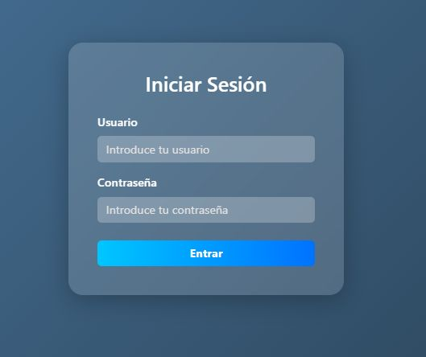
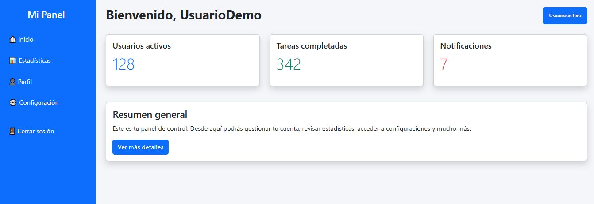

# 🛡️ Login MVC — Sistema de Autenticación Seguro en PHP

Sistema de autenticación desarrollado en **PHP** siguiendo el patrón **MVC (Modelo‑Vista‑Controlador)**.  
Incluye múltiples medidas de seguridad tanto en el cliente como en el servidor, con el objetivo de demostrar cómo construir un login **robusto, mantenible y protegido** frente a ataques comunes como:

- SQL Injection  
- XSS  
- Session Hijacking  
- Fuerza bruta  
- Fijación de sesión  

---

## ✨ Características principales

### 🔐 Autenticación segura
- Contraseñas cifradas con `password_hash()`
- Verificación mediante `password_verify()`
- Consultas SQL preparadas con PDO
- Sanitización de entradas del usuario
- Escapado de salida para evitar XSS

### 🛡️ Sesiones y cookies seguras
- Cookie de sesión configurada con:
  - `httponly`
  - `secure` (si hay HTTPS)
  - `samesite=Strict`
- Regeneración del ID de sesión tras login
- Token interno de sesión
- Verificación de User‑Agent e IP
- Expiración automática por inactividad
- Destrucción segura de sesión al cerrar sesión

### 🚫 Control de intentos fallidos
- Registro de intentos por usuario
- Bloqueo temporal tras varios intentos incorrectos
- Cálculo del tiempo restante de bloqueo
- Limpieza automática tras login exitoso

### 🧼 Validación y sanitización
- Validación en cliente mediante JavaScript
- Sanitización en servidor con `filter_var()` y `trim()`
- Escapado de salida con `htmlspecialchars()`

### 🧩 Arquitectura MVC
- **Modelos** → lógica de datos y consultas SQL  
- **Controladores** → flujo de autenticación y seguridad  
- **Vistas** → HTML limpio sin lógica de negocio  
- `index.php` en la raíz como *Front Controller*  
- Carpeta `public/` para recursos estáticos (CSS, JS, imágenes)

---

## 📁 Estructura del Proyecto

```txt
/Login_MVC/
│
├── config/
│   ├── Database.php
│   └── establecer-sesion.php
│
├── controllers/
│   └── AuthController.php
│
├── models/
│   └── User.php
│
├── views/
│   ├── dashboard.php
│   └── login.php 
│
├── public/
│   ├── styles.css
│   └── verificaciones.js
│
├── index.php
└── README.md
```

---

## 🔧 Instalación

1. **Clona el repositorio**
   ```bash
   git clone https://github.com/fgonmar445/login_mvc
   ```

2. **Importa la base de datos**
   - Abre phpMyAdmin
   - Crea una base de datos llamada `login_php`
   - Importa el archivo `login-php.sql` incluido en el proyecto

3. **Configura la conexión en `config/Database.php`**
   ```php
   $this->conn = new PDO("mysql:host=localhost;dbname=login_mvc", "root", "");
   ```

4. **Inicia el servidor local**
   ```bash
   php -S localhost:8000
   ```

5. **Accede desde el navegador**
   ```
   http://localhost:8000
   ```

---

## 🗄️ Esquema de la Base de Datos

```sql
CREATE TABLE users (
  (
    `codUser` int(10) NOT NULL,
  `idUser` varchar(15) NOT NULL,
  `password` varchar(255) NOT NULL,
  `nombre` varchar(15) NOT NULL,
  `apellidos` varchar(15) NOT NULL
) ENGINE=InnoDB DEFAULT CHARSET=utf8mb4 COLLATE=utf8mb4_general_ci;
);
```

---

## 📸 Interfaz de Usuario

### ✨ Login
> Login de acceso al sistemas


### ⚙️ Dashboard
> Vista principal donde se muestra el inicio de la aplicacion.

---

## 🚧 Mejoras futuras

- Recuperación de contraseña por email  
- Doble factor de autenticación (2FA)  
- Roles y permisos (admin/usuario)  
- Logs de actividad  
- API REST para autenticación externa  

---

## 👤 Autor

Proyecto desarrollado por **Felipe González**  
📧 Contacto: felipemarbouh@gmail.com

